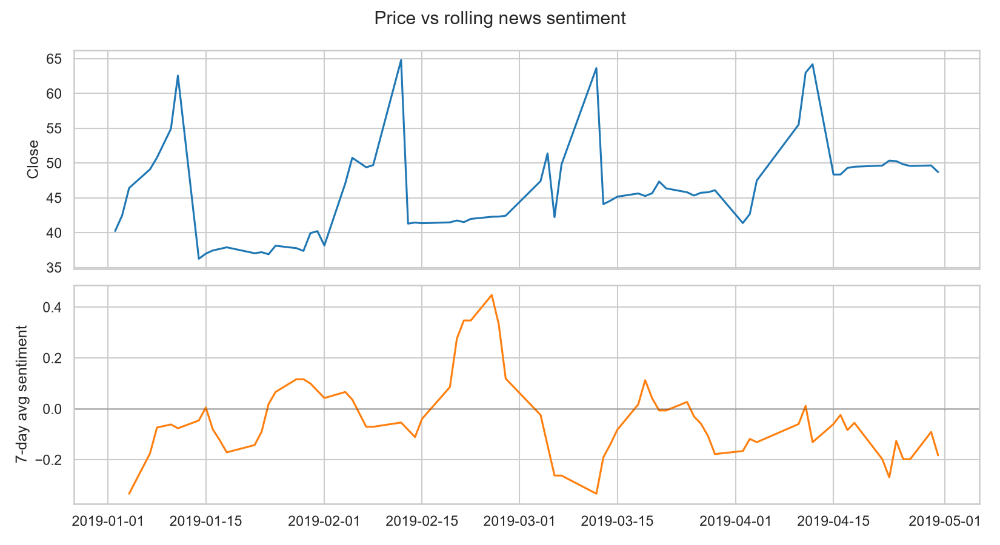

**Live dashboard:** https://sahil01bhoir.github.io/financial-news-sentiment-analysis/dashboard.html
# Financial News Sentiment Analysis & Weekly Event Summarizer

An end-to-end pipeline that classifies the sentiment of financial news, summarizes the most impactful positive and negative events each week with an LLM, and tests how sentiment shifts relate to stock price moves.

## Dataset schema
| Column | Description |
|---|---|
| Date | Trading day |
| News | Headline / article text |
| Open, High, Low, Close | Daily price data |
| Volume | Trading volume |
| Label | `1` Positive, `0` Neutral, `-1` Negative |

`data/news_stock.csv` holds the real dataset: 349 Apple-related news articles over 71 trading days (2 Jan – 30 Apr 2019), labelled Positive / Neutral / Negative. There are several articles per day, while prices and volume are the same for every article on a given day. The pipeline therefore works at two levels: **article level** for text classification and **day level** for returns, correlations and the backtest (a day's sentiment = mean label of its articles).

`src/generate_sample_data.py` can still create a synthetic file if `data/news_stock.csv` is missing.

> Caveat: ~4 months and 349 articles is a small sample. Treat model scores and the backtest as illustrative, and say so in your write-up.

## Workflow
1. **Preprocessing & EDA** (`src/preprocess_eda.py`) – de-duplication, text cleaning, return / volatility / range features, sentiment distribution, sentiment vs price and volume.
2. **Embeddings & modelling** (`src/embeddings_models.py`) – TF-IDF baseline, Word2Vec (trained on corpus), GloVe (pre-trained), Sentence Transformers (`all-MiniLM-L6-v2`), each with Logistic Regression and Random Forest. Evaluated on a **chronological, date-based** split (no look-ahead leakage; the last 20% of days form the test set) using macro-F1.
3. **Weekly summarization** (`src/summarize_weekly.py`) – ranks events by `|next-day return| × volume z-score`, then an LLM writes a weekly digest with an outlook. Set `ANTHROPIC_API_KEY` to enable; otherwise a template fallback is used.
4. **Insights** (`src/insights.py`) – lagged sentiment→return correlation, 5-day forward returns after sentiment surges/drops, and a simple long/short backtest vs buy & hold with transaction costs.

## Run
```bash
pip install -r requirements.txt
python run_pipeline.py
```
Outputs: `reports/figures/*.png`, `reports/model_results.csv`, `reports/weekly_summaries.md`, `reports/insights.md`.

## Design choices worth mentioning in interviews
- Time-based train/test split to avoid leaking future information.
- Class-weighted models and macro-F1 because sentiment classes are imbalanced.
- Sentiment is lagged by one day in the backtest (trade on yesterday's signal).
- Backtest is illustrative: no slippage modelling, single asset, in-sample signal. Use model predictions on the test period for an honest out-of-sample check.

## Extensions
- Fine-tune FinBERT and compare with the embedding+classifier approach.
- Add Twitter/X or Reddit sentiment as a second signal and compare its lead/lag against news.
- Add a Power BI / Streamlit dashboard on top of `weekly_summaries.csv`.
- Granger causality tests and walk-forward validation.
